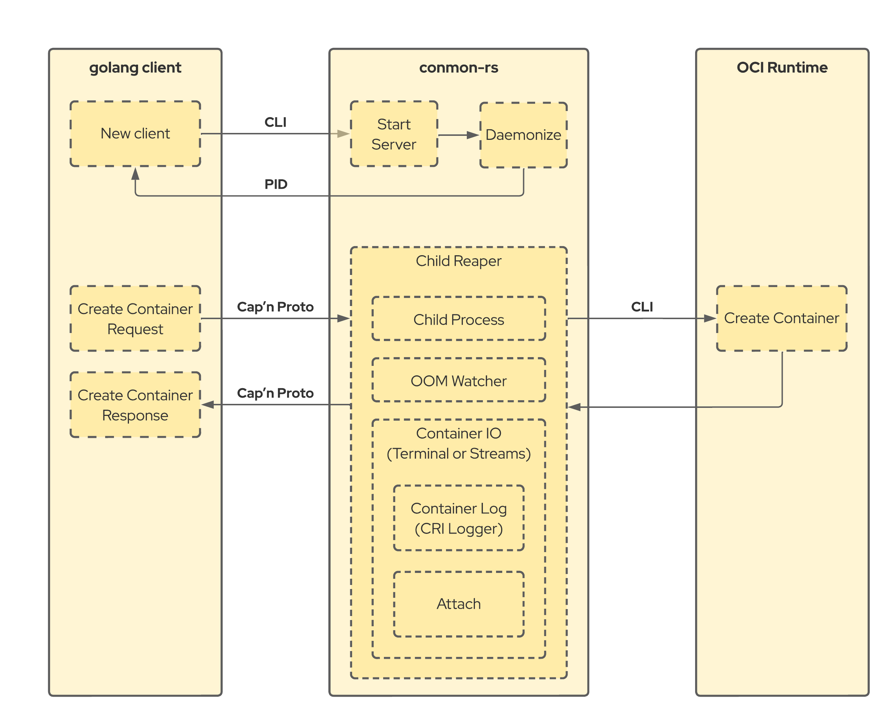

# Conmon-rs

A pod level OCI container runtime monitor.

The goal of this project is to provide a container monitor in Rust. The scope of conmon-rs encompasses the scope of the c iteration of
[conmon](https://github.com/containers/conmon), including daemonizing, holding open container standard streams, writing the exit code.

However, the goal of conmon-rs also extends past that of conmon, attempting to become a monitor for a full pod (or a group of containers).
Instead of a container engine creating a conmon per container (as well as subsequent conmons per container exec), the engine
will spawn a conmon-rs instance when a pod is created. That instance will listen over an UNIX domain socket for new requests to
create containers, and exec processes within them.

## Architecture

The whole application consists of two main components:

1. The Rust server: [conmon-rs/server](./conmon-rs/server) ([docs](https://containers.github.io/conmon-rs/conmon/struct.Server.html))
1. A golang client: [pkg/client](./pkg/client) ([docs](https://pkg.go.dev/github.com/containers/conmon-rs/pkg/client#ConmonClient))

The golang client should act as main interface while it takes care of creating
the server instance via the Command Line Interface (CLI) as well as
communicating to the server via [Cap’n Proto](https://capnproto.org). The client
itself hides the raw Cap’n Proto parts and exposes dedicated golang structures
to provide a clean API surface.

The following flow chart explains the client and container creation process:

## Goals

- [x] Single conmon per pod (post MVP/stretch)
- [x] Keeping RSS under 3-4 MB
- [x] Support exec without respawning a new conmon
- [x] API with RPC to make it extensible (should support golang clients)
- [ ] Act as pid namespace init
- [ ] Join network namespace to solve running hooks inside the pod context
- [ ] Use pidfds (it doesn't support getting exit code today, though)
- [ ] Use io_uring
- [ ] Plugin support for seccomp notification
- [ ] Logging rate limiting (double buffer?)
- [ ] Stats
- [ ] IPv6 port forwarding

## Future development

In the future, conmon-rs may:

- Be extended to mirror the functionality for each runtime operation.
  - Thus reducing the amount of exec calls that must happen in the container
    engine, and reducing the amount of memory it uses.
- Be in charge of configuring the namespaces for the pod
  - Taking over functionality that
    [pinns](https://github.com/cri-o/cri-o/tree/main/pinns) has historically
    done.
